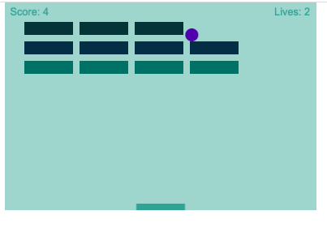

# Break Out Game

This project is a recreation of the classic arcade Break Out game, following the
[mdn web docs tutorial](https://developer.mozilla.org/en-US/docs/Games/Tutorials/2D_Breakout_game_pure_JavaScript). The game was originally written using a simple but limiting approach with vanilla JS, and through this assignment I have improved the quality of the code used in the game by using Object Oriented Programming (OOP) techniques and converting the code to Typescript. I have bundled my code by setting up a build system that processes the files from the Break Out project and creates files for distribution.

# How to Play:

Open project in browser. Control the paddle with the keyboard arrows or mouse cursor to deflect the ball towards the bricks. Each brick is counted as one point. The player starts the game with three lives, and will lose a life if the player fails to deflect the ball. Win the game when all bricks have been hit. 

# Screenshot:

